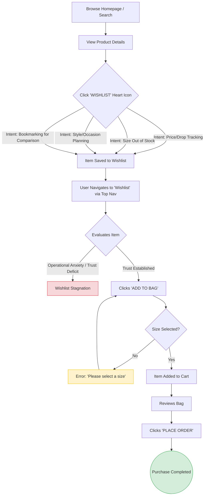

# Wishlist to Purchase Workflow Diagram

This workflow diagram visualizes the user journey from adding an item to the wishlist to completing the purchase, highlighting the critical drop-off points identified by our AI Discovery Engine.

### Key Insights Highlighted in the Diagram:
- **The Major Bottleneck:** The transition from `Wishlist Evaluation` to `Add to Cart` is where the majority of drop-offs occur. Our data shows that 68.8% of users (Trust-Gated Shoppers) pause here due to a lack of trust in the post-purchase experience (delivery, returns, refunds).
- **The Minor Bottleneck:** The transition from `Checkout Phase` to `Purchase Completed` sees much less friction. Cart abandonment accounts for only 3.2% of the issues based on our evidence types.
- **Strategic Focus:** Interventions must happen at the `Wishlist Evaluation Phase` to shift users from the "Stagnation" path to the "Add to Cart" path by mitigating perceived risks.
