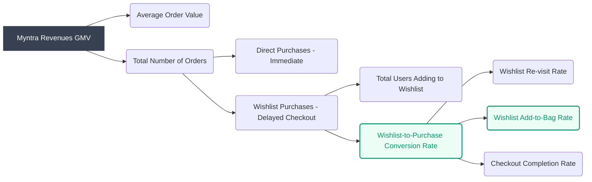
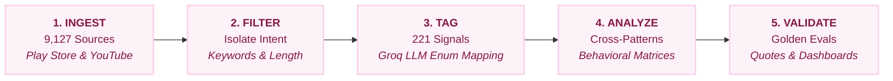

# Slide 2: Business Metric Decomposition

---

## 🟥 LEFT COLUMN (The Context & Foundation)

### **Myntra App**
Myntra is India's leading fashion e-commerce company, offering a massive top-of-funnel discovery engine catering to over **60 million** monthly active users in major cities.

### **Mission**
**Democratize fashion** and lifestyle, making it accessible to everyone while sustaining profitable margin growth.

### **Value Proposition**
Myntra offers a vast selection of fashion, beauty, and lifestyle brands, coupled with personalized recommendations, seamless discovery, and a robust **Wishlist** feature for curating intent.

### **Business Model**
**Marketplace & Inventory-led Model**
*   Discovery & Curation are **free** for everyone.
*   Revenue is generated via **GMV** on purchases.
*   *Converting passive Wishlist intent into active purchases without relying on deep discounts is the primary growth lever.*

> **[Business Outcome]** ⬆️ GMV Revenue **Translates to** Margin Growth ⬆️
> 
> **[Product Outcome]** ⬆️ % Wishlist-to-Purchase Conversion Rate & % Add-to-Bag Rate ⬆️

---

## 🟩 RIGHT COLUMN (The Problem & Metrics)

### **Problem Statement** 
> Increase the percentage of Monthly Active Customers who purchase at least one item from their wishlist.

### **Problem Breakdown: Why is unlocking Wishlist Intent important?**

| Focus Area | Rationale |
| :--- | :--- |
| **Unit Economics** | Relying heavily on GMV, unlocking pent-up demand sitting in wishlists directly improves unit economics and inventory turnover. |
| **Bottleneck Scale** | Despite ~60M MAU, the industry average abandonment rate is ~70.2%, with vast intent passively parked in Wishlists. |
| **Validation Deficit** | Primary blocker is a "Pre-Purchase Validation Deficit" (fear of delivery/returns). Solving this drives non-discounted conversions. |

### **Mapping Business Outcomes to Product Outcomes**

---

# Slide 3: AI Discovery Engine — Architecture & Workflow

### **From Raw Feedback to PM Direction**

 

<table width="100%" style="border-collapse: separate; border-spacing: 10px;">
<tr>
<td width="50%" valign="top" style="background-color: #fdf2f8; padding: 15px; border-radius: 8px; border: 1px solid #fbcfe8; color: #831843;">
<b>📊 1. The Data (Quantitative Proof)</b>  
From 9,127 scraped sources, 221 high-intent wishlist signals were isolated. The taxonomy revealed: 
• <b>59.7%</b> driven by a <i>Trust Deficit</i> (vs 4.5% Price Sensitivity). 
• <b>68.8%</b> are <i>Trust-Gated Shoppers</i> (willing to buy, but afraid). 
• <b>54.3%</b> evidence was <i>Delivery Complaints</i>. 
• Only <b>3.2%</b> was traditional Cart Abandonment.
</td>
<td width="50%" valign="top" style="background-color: #fdf2f8; padding: 15px; border-radius: 8px; border: 1px solid #fbcfe8; color: #831843;">
<b>🏷️ 2. How Themes Are Generated</b>  
<b>Strict Enum Mapping</b> 
Instead of open-ended generation, the Groq LLM acts purely as a tag-labeler mapping to predefined dimensions (Decision Drivers, User Segments). Pydantic schema validation ensures zero hallucination.
</td>
</tr>
<tr>
<td width="50%" valign="top" style="background-color: #fdf2f8; padding: 15px; border-radius: 8px; border: 1px solid #fbcfe8; color: #831843;">
<b>🔍 3. How Insights Are Generated</b>  
<b>Behavioral Math & Synthesis</b> 
Recurring pairs of tags are tallied mathematically to find cross-patterns. The highest-frequency intersections (e.g., Trust Deficit × Trust-Gated Shopper) are fed back into the LLM with verbatim quotes to generate grounded insights.
</td>
<td width="50%" valign="top" style="background-color: #fdf2f8; padding: 15px; border-radius: 8px; border: 1px solid #fbcfe8; color: #831843;">
<b>💡 4. PM Prioritization & Hypothesis</b>  
<b>Why Focus on Delivery Anxiety?</b> 
As a PM, prioritization is driven by scale and impact. Delivery complaints account for <b>54.3%</b> of all behavioral evidence—dominating price sensitivity by over 12x. Solving this single friction point unlocks the largest cohort of users (68.8% Trust-Gated Shoppers).  
<b>The "Holding Area" Hypothesis</b> 
Users add items to wishlists as a "holding area" while evaluating if Myntra can be trusted to deliver reliably.  

<i>"After waiting for 10-20 days, they cancelled the order without any transparency."</i>

</td>
</tr>
</table>

