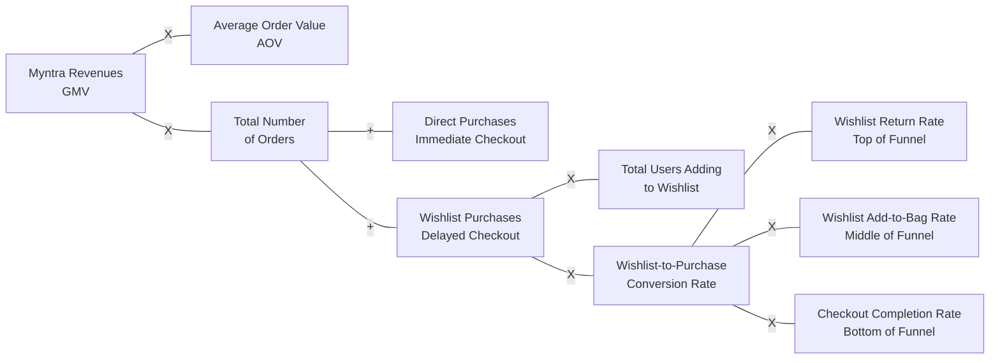

# Supporting Research & Metric Decomposition

This document provides the mathematical breakdown and raw data sources supporting the strategic objective outlined in Slide 1.

## 1. Deep Dive: Mathematical Metric Tree
This flowchart demonstrates exactly how our specific product intervention impacts Myntra's macro business metrics.

## 2. Primary Data Sources & Evidence (Industry Research)

**Insight 1: Myntra's Massive Scale & Reach**
* **Data Point:** Myntra reported a 33% surge in Monthly Active Users (MAU), reaching 60 million by the end of 2023, and scaling up to 70 million during the 2024 festive seasons.
* **Source:** LiveMint & Business Standard (2024).

**Insight 2: The E-commerce Abandonment Bottleneck**
* **Data Point:** The average e-commerce cart/wishlist abandonment rate is a staggering **70.22%**. A massive segment of these users do not abandon due to price, but rather use the interface as a passive "holding area" while they evaluate trust and logistics before committing.
* **Source:** Baymard Institute (Meta-analysis of 50 independent e-commerce studies, 2024).
