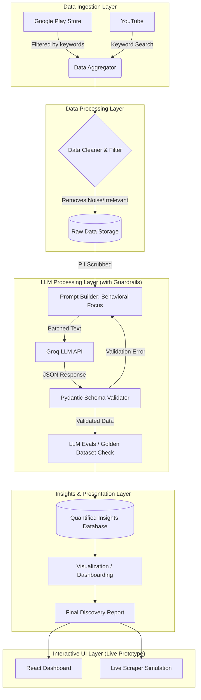

# System Architecture: AI-Powered Discovery Engine for Myntra Wishlist

This document outlines the high-level system architecture for the Myntra Wishlist Discovery Engine. The system is designed to ingest data from diverse platforms, filtering for high-intent wishlist signals, and use LLMs to extract behavioral psychology insights.

## High-Level Architecture Diagram

## 1. Data Ingestion Layer
Gathers raw feedback focusing heavily on wishlist behavior, intent, and barriers to purchase.
- **Play Store Scraper:** Uses `google-play-scraper` fetching large volumes of reviews and filtering them locally for wishlist/cart related keywords.
- **YouTube API Module:** Uses `google-api-python-client` to search for "Myntra wishlist haul", "Myntra wishlist vs reality", extracting titles and comments.

## 2. Data Processing & Storage Layer
- **Data Cleaner & Filter:** 
  - Standard text cleaning.
  - Strict filtering to ensure only texts containing signals related to saving, wishlisting, hesitating, or comparing are passed to the LLM.

## 3. LLM Processing Layer (The Core Engine with Guardrails)
- **PII Filter:** Scrubs personally identifiable information before hitting the Groq API.
- **Prompt Builder:** Constructs prompts instructing the Groq model to act as a behavioral product manager. It asks the LLM to identify the specific friction point, the user's underlying need, and categorize the barrier.
- **Groq API Integration:** Handles inference endpoints.
- **Guardrails (Pydantic & Tenacity):** Replaces basic string parsing with strict schema validation. If the LLM hallucinates an invalid tag, a retry loop injects the error back into the prompt to auto-correct.
- **LLM Evals Pipeline:** Runs periodic precision/recall checks against a manually annotated 20-review "Golden Dataset" to prevent regression.

## 4. Insights & Presentation Layer
- **Processed Insights Database:** Stores the final LLM-evaluated data.
- **Visualization Module:** Charts showing the most common non-monetary barriers preventing 30-day conversion.
- **Final Reporting:** A structured breakdown of the Discovery Engine's findings, highlighting non-monetary opportunity areas for the Growth team.

## 5. Interactive Prototype Layer (Live Working)
- **React Dashboard:** A live, clickable interface to explore the discovery findings (e.g., viewing Trust Deficit percentages dynamically by source).
- **Live Scraper Simulation:** A visual terminal demonstrating the ingestion pipeline actively filtering noise and categorizing high-intent wishlist behaviors, complete with real-time dynamic graphing based on source.
