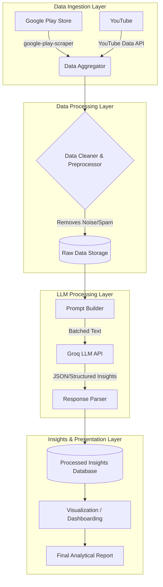

# System Architecture: Sentiment and User Experience Analysis of Myntra

This document outlines the high-level system architecture for the Myntra user feedback analysis project. The system is designed to be modular, scalable, and efficient, ensuring seamless data flow from raw user reviews to actionable LLM-generated insights.

## High-Level Architecture Diagram

## 1. Data Ingestion Layer
This layer is responsible for gathering raw, unstructured feedback from our target sources.
- **Play Store Scraper Module:** Utilizes the `google-play-scraper` library to extract app ratings, review text, review dates, and app versions for the target package (configured via `PLAY_STORE_PACKAGE`).
- **YouTube API Module:** Utilizes the `google-api-python-client` library to search for Myntra-related keywords across fashion and lifestyle videos, extracting video titles, descriptions, and top comments.

## 2. Data Processing & Storage Layer
Raw data from the internet is often messy. This layer handles cleaning and persistence.
- **Data Cleaner & Preprocessor:** 
  - Removes duplicate entries, URLs, emojis, and irrelevant special characters.
  - Normalizes text (e.g., lowercase conversion, expanding contractions).
  - Filters out excessively short or non-informative reviews.
- **Storage:** Cleaned data is temporarily stored in structured formats like CSV or an SQLite database before being sent to the LLM.

## 3. LLM Processing Layer (The Core Engine)
This layer acts as the brain of the project, using the Groq LLM to extract meaning from the text.
- **Prompt Builder:** Dynamically constructs prompts that instruct the Groq model on how to evaluate the given text. It enforces a strict output format (e.g., JSON) so the data can be easily parsed.
- **Groq API Integration:** Handles the network calls to the Groq inference endpoints. Groq is chosen here for its ultra-low latency, which allows for rapid processing of large datasets.
- **Response Parser:** Validates and parses the structured responses returned by Groq. It extracts sentiment scores (Positive, Negative, Neutral) and categorization tags (e.g., UI/UX, Delivery, Product Quality, Customer Support).

## 4. Insights & Presentation Layer
The final layer turns structured data into human-readable, actionable insights.
- **Processed Insights Database:** Stores the final LLM-evaluated data, making it queryable.
- **Visualization Module:** Uses Python libraries such as `matplotlib`, `seaborn`, or `plotly` (or a web dashboard like `Streamlit`) to generate visual reports.
  - Examples: Pie charts of overall sentiment, bar charts of most requested features, trend lines of bugs reported over time.
- **Final Reporting:** Aggregates visualizations and key findings into a comprehensive analytical report for stakeholders.
